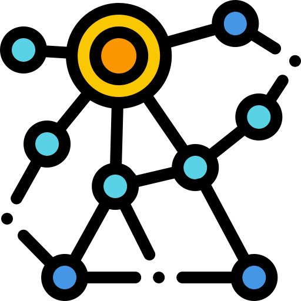

  [Introduction, Trick and Tips]({{ site.baseurl }})

  [Vim - Introduction](/202.html) - WIP

  [Shell Scripting](/202.html) - WIP

  [Docker](/202.html) - WIP

  [Kubernetes](/202.html) - WIP

  [Matplotlib - PyPlotLib](/202.html) - WIP

  [Latex](/202.html) - WIP

  [On the understanding of Java and Python - common points](/202.html) - WIP

  [Java Architectures](/202.html) - WIP

  [Java EE / Intro to Quarkus](/202.html) - WIP

  [JUnit - Testing Frameworks](/202.html) - WIP

  [Graph Neural Networks (GNNs)](/202.html) - WIP

  [High Performance Computing - The SLURM Batch Scheduler](/202.html) - WIP

